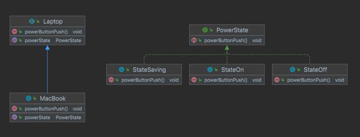

## State Pattern 이란 무엇인가?


객체가 특정 상태에 따라 행위를 달리하는 상황에서, 

상태를 체크하고 이에 따른 행위를 호출하는 것이 아닌

`상태를 객체화`하여 행동을 할 수 있도록 위임하는 패턴이다.

---

## Why ? State Pattern을 왜 사용하여아 하는가?

State는 literally 상태를 뜻한다. 현실 세계에서 객체는 동일한 동작도 `상태에 따라 다른 출력값`을 낸다.

### 장점
- 모든 상태에 대한 behavior가 한 곳에 모여있어서 유지보수에 용이하다.
- 긴 분기문을 제거할 수 있다.

### 단점
- 분기가 많지 않다면 State pattern을 사용하는 것이 오히려 복잡해질 수 있습니다.

### 노트북을 예시로 확인해보자.

> 노트북은 하나의 전원 버튼만 가지고 있다. 전원 버튼은 상태에 따라 아래와 같이 동작한다.
>
> **꺼진 상태 -> 전원 On**
>
> **켜진 상태 -> 전원 Off**
>
> **절전 모드 -> 화면 깨우기**


---

## 예제 코드




`PowerState`라는 여러 가지 상태가 Implements할 Interface를 선언해주었습니다.

구체적인 상태 객체로는 `Saving`, `On`, `Off`를 구현하였습니다.

### State

```java
package state;

public interface PowerState {
    void powerButtonPush();
}
```

```java
package state;

public class StateOn implements PowerState{
    @Override
    public void powerButtonPush() {
        System.out.println("전원을 종료합니다.");
    }
}
```

```java
package state;

public class StateSaving implements PowerState{
    @Override
    public void powerButtonPush() {
        System.out.println("화면을 깨웁니다.");
    }
}
```

### Context 

다음으로는 Context를 정의하였습니다.

`의존성 주입`이 필요하기 때문에 `abstract class`로 구현하여 미리 주입을 해주었습니다.

```java
package Computer;

import state.PowerState;

public abstract class Laptop {
    private PowerState powerState;

    public void setPowerState(PowerState powerState) {
        this.powerState = powerState;
    }

    public void powerButtonPush(){
        powerState.powerButtonPush();
    }
}
```

```java
package Computer;

import state.PowerState;

public class MacBook extends Laptop{

    @Override
    public void setPowerState(PowerState powerState) {
        super.setPowerState(powerState);
    }

    @Override
    public void powerButtonPush() {
        super.powerButtonPush();
    }
}
```

---

## 정리

앞서 보았던 Strategy Pattern과 `의존성 주입`을 하고, setter를 통해서 `주입된 객체의 상태를 바꿔준다`는 면에서 유사한 패턴이라는 생각이 들었습니다.

Strategy Pattern은 상태에 따라 다른 전략, 알고리즘을 부여할 때 사용하고,

State Pattern은 객체의 상태에 따라 어떤 행동을 취할지 부여할 때 사용할 수 있습니다.


